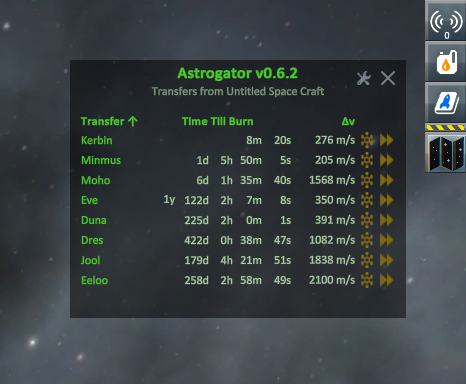
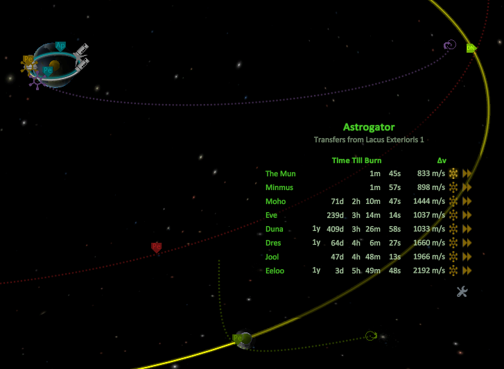
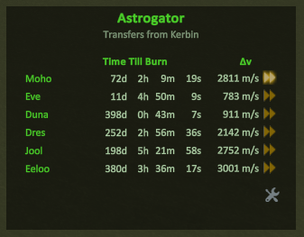
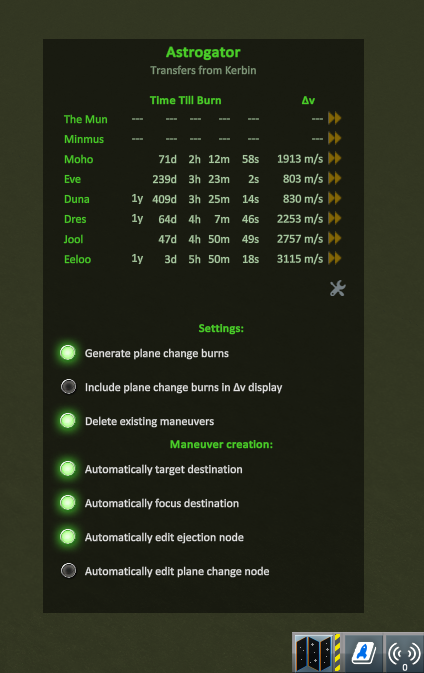

# Astrogator

A space-navigational aide for [Kerbal Space Program](http://www.kerbalspaceprogram.com/).

See all the transfers that you could choose from your current location at a glance, including the time till the burn and delta V, and turn them into maneuvers with one click.

[![Donate][Donation image]][Donation link]

[Donation link]: https://www.paypal.com/cgi-bin/webscr?cmd=_donations&business=7H2LCH6SP7TTE&lc=US&item_name=HebaruSan_Mods&currency_code=USD&bn=PP%2dDonationsBF%3abtn_donate_LG%2egif%3aNonHosted

[Donation image]: https://i.imgur.com/M9m07Qw.png

## Download

The [latest version] is available on Github.

[latest version]: https://github.com/HebaruSan/Astrogator/releases/latest

Unzip to your GameData folder.

## Features

### Automatic maneuver node creation

When you're piloting a vessel, maneuver node icons will appear next to the delta V numbers.
Click to create maneuver nodes for that transfer:

These typically give immediate encounters for transfers to the Mun from low Kerbin orbit, and sometimes Minmus, Duna, and Jool, but some adjustment is usually needed for other destinations.

### Time warping

Click a warp icon to warp to 5 minutes before the corresponding transfer.
If it's already within 5 minutes, you'll be auto-warped to the exact time of the transfer.

### More transfers, fewer clicks

- Shows transfers for all main reachable spheres of influence, including from parent spheres of influence, not just bodies with the same parent
- Supports transfers to vessel's target, regardless of what it is
- Handles "nested" ejection burns, such as when you need to burn at the right time to escape Laythe at the right time to escape Jool at the right time to reach Kerbin
- Supports burns to bodies within the *current* sphere of influence, such as the moons of Kerbin from low Kerbin orbit
- Uses the active vessel's location and orbital parameters to fill in as many of the input parameters as it can
- Shows you the results in zero clicks
- Integrates with the game to streamline use of the data
- Moves the map view focus automatically
- Sets the vessel's target
- Automatically opens maneuver nodes for editing

## Settings

Click the wrench to open the settings panel and the back button to close it:

| Setting | Description |
| --- | --- |
| Generate plane change burns | If you turn this off, then only (prograde) ejection maneuvers will be calculated. This may be needed if the plane change calculations become disruptive. |
| Add plane change burns to Δv column | If you enable this, then the delta V shown in the table will be the ejection node plus the plane change node. Otherwise only the ejection delta V is shown, to make ejection burns less confusing when flying without maneuver nodes. |
| Auto-delete user-created maneuver nodes | Our method for calculating plane changes doesn't work if other unrelated maneuvers are active. By default, we simply don't calculate them if that happens. Enabling this setting tells Astrogator to go ahead and delete your nodes if it needs to. **Use with caution!** |
| Calculate transfers to tracked asteroids | When this is enabled, tracked astroids will be included in the list of transfers as if they were celestial bodies. |
| Automatically target destination | When this is enabled, clicking the maneuver node icon will set the destination as the active vessel's target. This can be helpful because it enables the close approach markers. |
| Automatically focus destination | When this is enabled, clicking the maneuver icon will change the map view focus. If the default maneuvers create an encounter with the desired body, then that body will be focused so you can fine tune your arrival; otherwise the destination's parent body will be focused so you can establish the encounter. |
| Automatically edit ejection node | When this is enabled, clicking the maneuver icon will leave the first node open for editing. |
| Automatically edit plane change node | If you enable this, then the second node will be opened for editing instead of the first. |
| Automatically set SAS to maneuver mode | When this is enabled, clicking a maneuver creation button will activate SAS and put it into maneuver mode, which will cause your craft to orient toward the maneuver. |
| Adjust nodes with translation controls when RCS is off | When this is enabled and RCS is turned off, maneuver nodes generated by Astrogator can be adjusted using the HNIJKL translation keys and the joystick translation axes. |
| Units: Metric | Shows delta V in m/s (meters per second) |
| Units: United States Customary | Shows delta V in mph (miles per hour) |

## Known limitations

- Blizzy's toolbar is not and will not be supported. 0.23.5 was a long time ago.
- It's not going to fly your ship for you. Other mods can do that already.
- Only the phase angle approximation is used, not full porkchop plots, for performance reasons.
- It doesn't do anything advanced or clever, such as gravity assists or aerobraking or periapsis raising for plane changes; only the basics to save you a trip to alexmoon.github.io/ksp/. If you want to perform a more sophisticated maneuver, you'll have to handle that yourself.
- We create a real maneuver node for the ejection burn temporarily to calculate the plane change burns. This means you have to refrain from messing with maneuvers while the window is loading.
- I can't get the maneuver / warp buttons to show their built-in `tooltipText` property, and they don't seem to have `onHover` events to set one up manually like we did for the app launcher, so it won't tell you what those icons do.

## Future plans

See [TODO.md](TODO.md).

## Building

See [INSTALL.md](INSTALL.md).

## References

### Plug-in authoring
- https://kerbalspaceprogram.com/api/index.html
- http://forum.kerbalspaceprogram.com/index.php?/topic/153765-getting-started-the-basics-of-writing-a-plug-in/
- http://forum.kerbalspaceprogram.com/index.php?/topic/151354-unity-ui-creation-tutorial/
- http://forum.kerbalspaceprogram.com/index.php?/topic/149324-popupdialog-and-the-dialoggui-classes/
- http://forum.kerbalspaceprogram.com/index.php?/topic/78231-application-launcher-and-mods/
- http://forum.kerbalspaceprogram.com/index.php?/topic/154006-solved-texture-issues/&do=findComment&comment=2904233

### Localization
- http://forum.kerbalspaceprogram.com/index.php?/topic/158018-addon-localization-home/

### Physics and math
- https://en.wikipedia.org/wiki/Hohmann_transfer_orbit
- https://en.wikipedia.org/wiki/Orbital_speed#Precise_orbital_speed
- https://www.reddit.com/r/KerbalAcademy/comments/35wtv1/how_do_i_calculate_phase_and_ejection_angle/crf3kc4/
- http://www.bogan.ca/orbits/kepler/orbteqtn.html
- https://d2r5da613aq50s.cloudfront.net/wp-content/uploads/411616.image0.jpg
- https://en.wikipedia.org/wiki/Orbital_inclination_change#Calculation
- https://en.wikipedia.org/wiki/Hyperbolic_trajectory#Hyperbolic_excess_velocity
- http://www.dtic.mil/dtic/tr/fulltext/u2/a200383.pdf
- http://forum.kerbalspaceprogram.com/index.php?/topic/122779-changing-orbital-angle-without-changing-apoapsis/
- https://upload.wikimedia.org/wikipedia/commons/e/eb/Orbit1.svg

### Performance
- http://www.somasim.com/blog/2015/04/csharp-memory-and-performance-tips-for-unity/
- http://forum.kerbalspaceprogram.com/index.php?/topic/142712-devnote-tuesday-smashing-buttons/&do=findComment&comment=2653161

## Credits, acknowledgements, and dedication

Special thanks to all those who have helped to translate Astrogator to other languages!

| Language | Translators |
| --- | --- |
| Spanish | Iván ([hashashin](https://github.com/hashashin)), [Deltathiago98](https://github.com/Deltathiago98) |
| Chinese | [QAQdong](https://github.com/QAQdong) |
| Russian | [Niev](https://github.com/Niev) |

- AN/DN logic and plane change calculations borrowed from MechJeb
- Phase angle logic and some icons borrowed from Kerbal Alarm Clock
- `.gitignore` borrowed from Transfer Window Planner
- `csproj` file adapted from Transfer Window Planner and Craft Import
- r4m0n for making it easy to find plane change nodes
- [TCShipInfo](http://forum.kerbalspaceprogram.com/index.php?/topic/59724-112-v04-resource-details-in-tracking-center/) for figuring out the tracking station API
- Main app icon modified from http://fontawesome.io/icon/map/
- Close X icon under Apache 2 license from https://material.io/icons/#ic_close and modified
- Back icon under Apache 2 license from https://material.io/icons/#ic_chevron_left
- ProjectGuid generated by https://www.guidgenerator.com/online-guid-generator.aspx
- Kepler, Hohmann, Tsiolkovsky, and Oberth for giving us the math
- In admiration of [Sailing Master Kevin Renner](https://en.wikipedia.org/wiki/The_Mote_in_God's_Eye)
